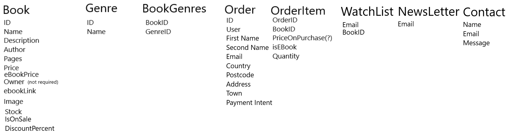

# Bookstore
A website for  .
See [here]() for the deployed site.

### Note: 
See [Features](#features=left-to-implement) about current limitations.

## User Stories
I used github [issues](https://github.com/edenobrega/ecom-bookstore-5p/issues) to create User Stories that would be automated to create a card in github [projects](https://github.com/edenobrega/ecom-bookstore-5p/projects/1)

## UX

### Wireframes
Basket

Checkout

Orders

Search form

Search Results

### ERD
Entity Relationship Diagram used for the project

## Features

### Existing Features

### Admin Features

### Other

## CRUD

### Create

### Read

### Update

### Delete

### Multiple In One

## Features left to implement

# Testing

# Deployment

# Local Deployment

## Technologies

## Credits