# Testing
## Accounts
- When trying to login, if the account doesnt exist or the password is incorrect an error will appear
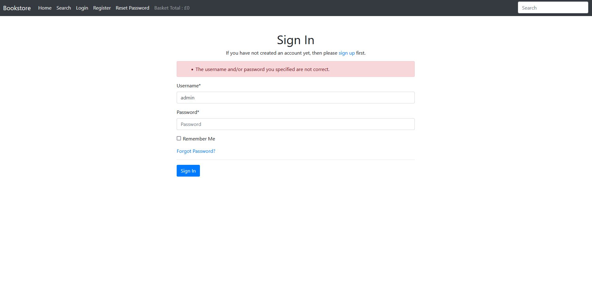

- If the correct information is entered then you will be logged in and the navbar will change
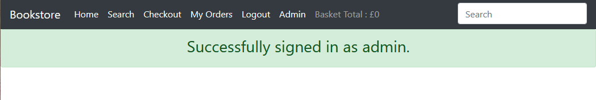

- If you don't fill out the whole form you will be given an error
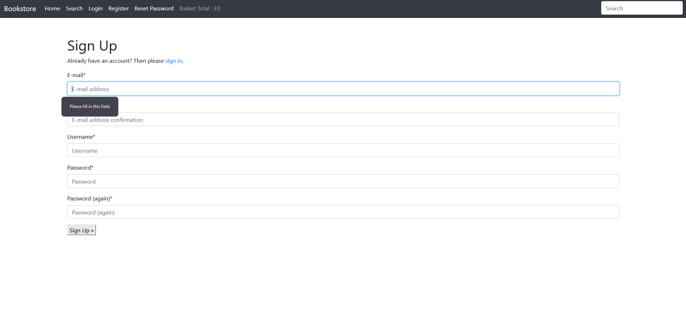
## Book
- If you search for a product it will return the results
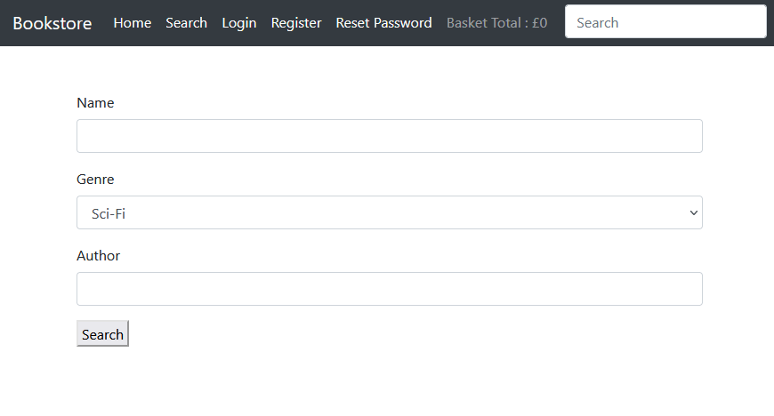
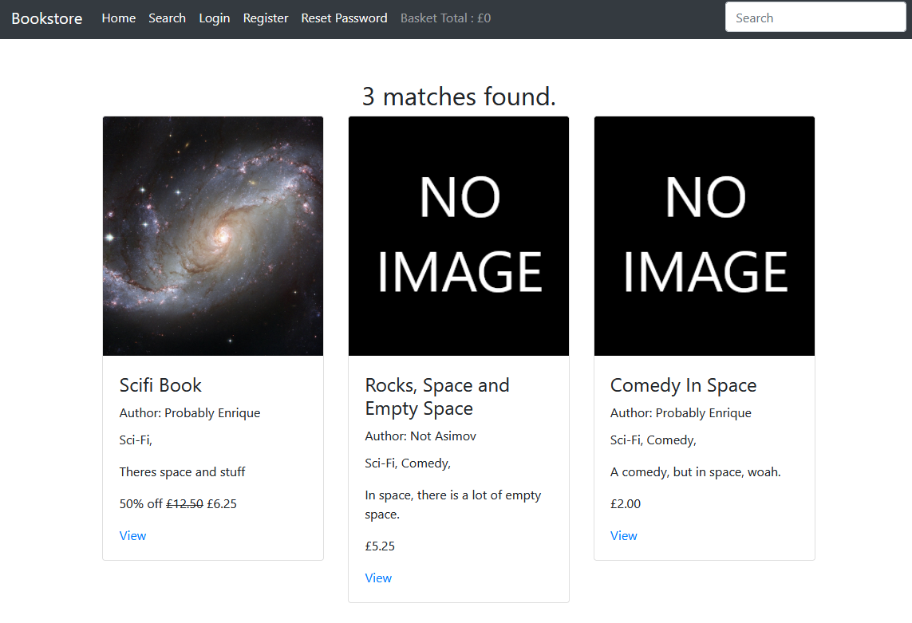

- If you search for a book with a name with no matches an error will be shown
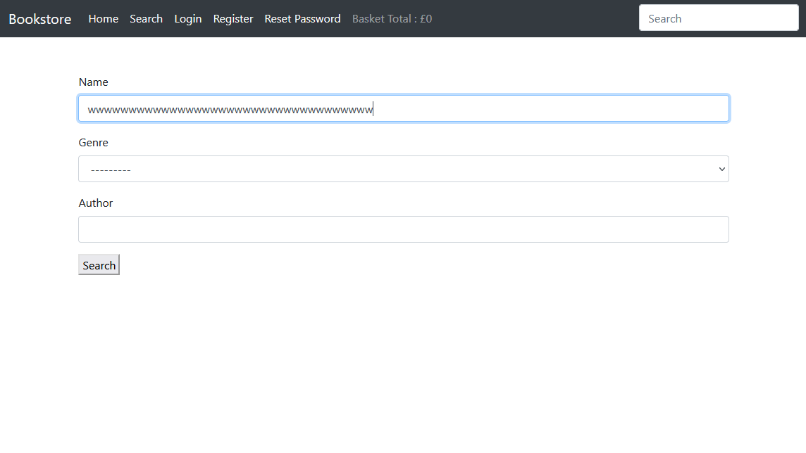
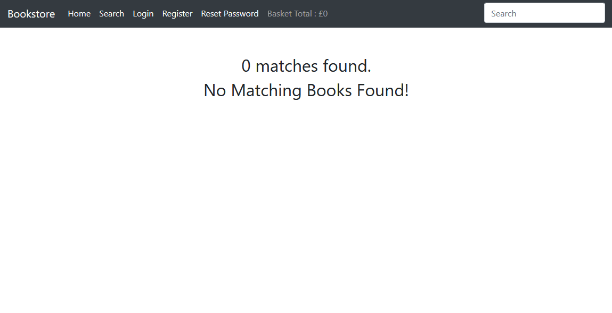

- If the item is out of stock or not available a button will appear
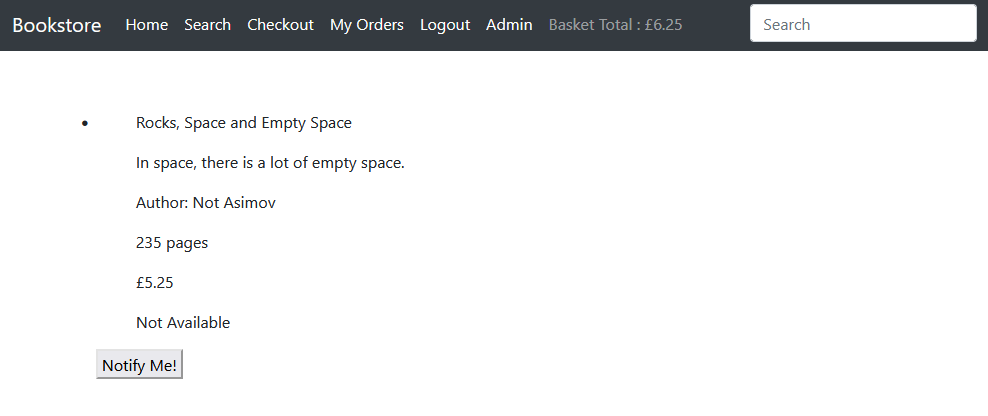
## Email
- Selecting "Notify Me!" will display a pop up that asks for your email.
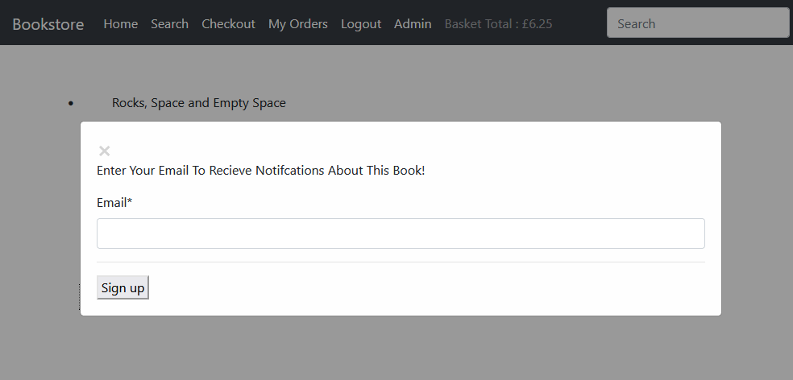

- If you do not have a watch on the item already a message will say so
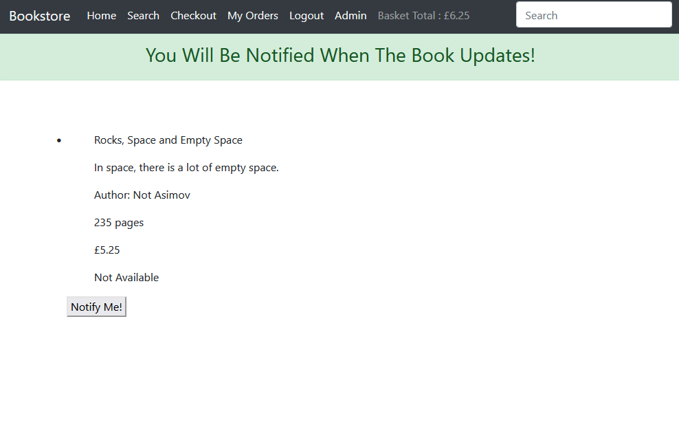

- If you already have a watch on the book a message will tell you
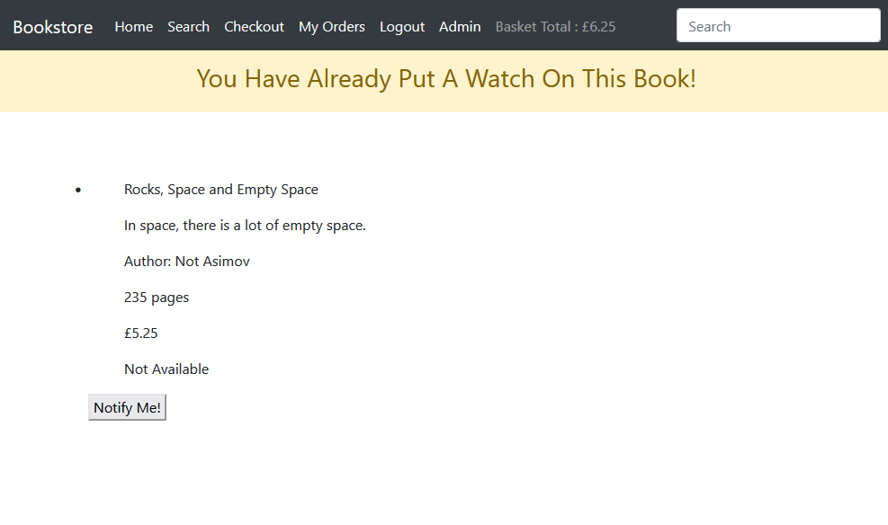
## Admin

# Basket
- If you have no products in your basket a message will tell you 
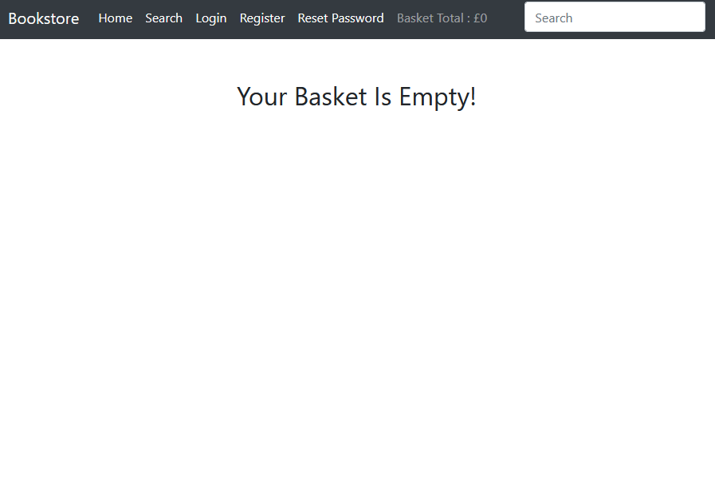

- If the book has been successfully added to your basket a message will tell you and your basket total will change
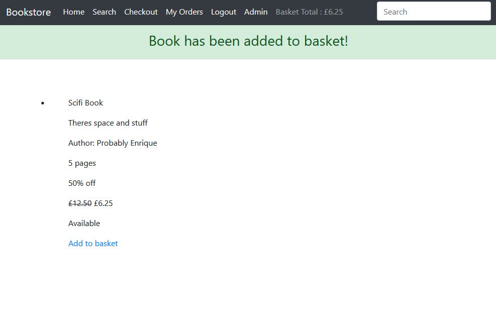

- If you have an item in your basket it will appear in your basket
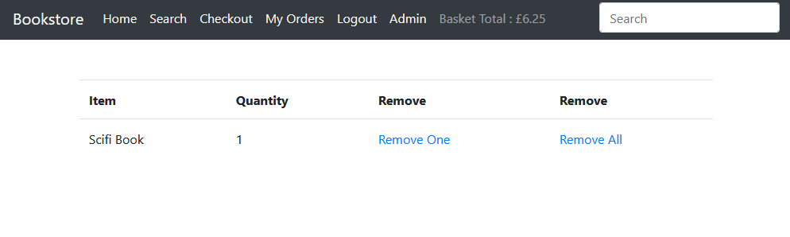